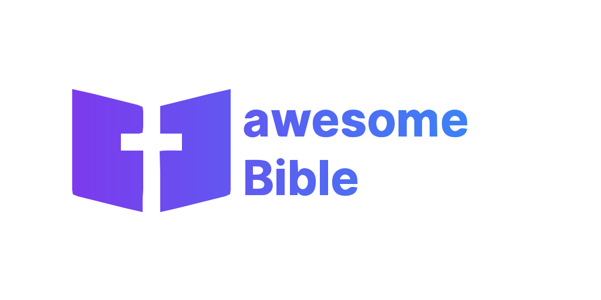

Willkommen bei der Dokumentation für awesomeBible Projekte!
===================================
Hier kannst du die Dokumentation für `my.awesomeBible <https://codeberg.org/awesomeBible/my.awesomeBible>`_ und `awesomeBible Verse <https://codeberg.org/awesomeBible/verse>`_ finden.

Die Dokumentation ist `open source <https://github.com/awesomebible/docs/>`_. Das Hosting wird großzügigerweise von `Read the Docs <https://readthedocs.org>`_ zur Verfügung gestellt.

.. note::

   Diese Dokumentation ist aktuell noch ein Work-in-Progress, aber bestehende und neue Dokumentation wird nach und nach hier hin verschoben.

.. toctree::
   :maxdepth: 1
   :caption: Verse

   verse/index

.. toctree::
   :maxdepth: 1
   :caption: my.awesomeBible

   my/index