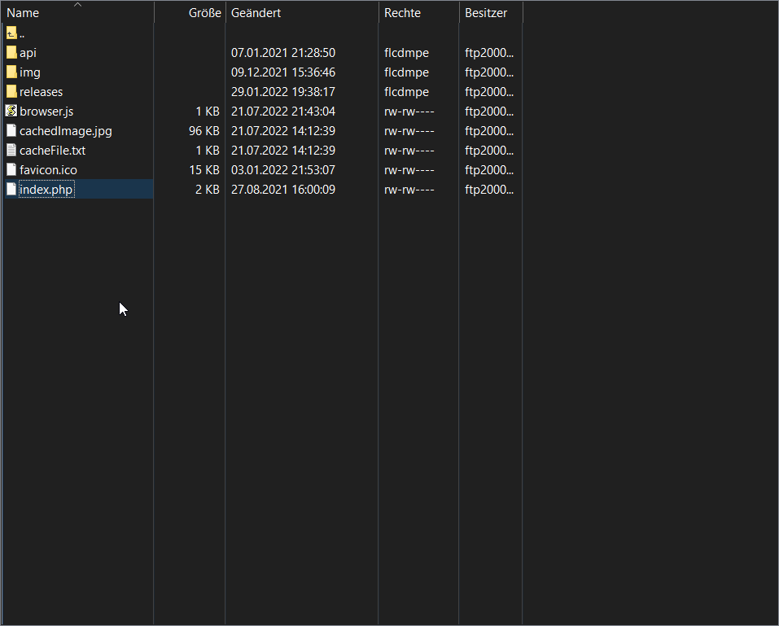
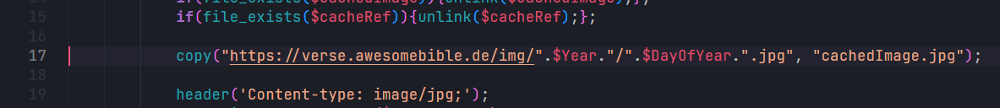

Installation
===================================

Anforderungen
=============

- PHP Server
- FTP Server / Zugang
- FTP Client: `Filezilla <https://filezilla-project.org/>`_, `WinSCP <https://winscp.net/eng/docs/lang:de>`:

1. Lade awesomeBible Verse herunter.
- Gehe zum `aktuellen Release von awesomeBible Verse <https://codeberg.org/awesomeBible/verse/releases/latest>`_ und lade die Quelltext Zip-Datei herunter.
1. Öffne den FTP Client deiner Wahl und verbinde dich mit deinem Server.
2. Navigiere in das Verzeichnis wo du awesomeBible Verse haben möchtest und lade nun den Inhalt der verse.zip-Datei hoch.

Empfohlen ist, awesomeBible Verse auf einer Subdomain z.B. verse.deinedomain.de 
zu installieren – wenn dies dein Hosting Provider zur Verfügung stellt. 
Ansonsten einfach in einen seperaten Ordner. Wenn auf deinedomain.de/ 
z.B. eine Wordress Installation ist, dann kannst du die Dateien einfach in einem Unterverzeichnis der selben Domain ablegen. (Zum Beispiel: deinedomain.de/verse/)

Bilder selbst hosten
=============

awesomeBible Verse besteht aus zwei Teilen:

1. Das Programm
2. Die Bilder

Das Programm haben wir gerade auf deinem Server installiert. Standardmäßig benutzt Verse die Bilder die von verse.awesomebible.de gehostet werden.

Um Last von dem einen Server zu nehmen, und zu verhindern dass wenn verse.awesomebible.de down ist alle Verse Installationen nicht mehr funktionieren, sollte man wenn möglich die Bilder ebenfalls selbst hosten.

Die Bilder herunterladen:
- Gehe zu `Versbilder.md <https://codeberg.org/awesomeBible/verse/src/branch/main/Versbilder.md>` und lade die passende Datei herunter. (Sortiert nach Jahreszahlen)

Einfach die ZIP-Datei herunterladen herunterladen und entpacken.

Den Inhalt kann man jetzt in einen Storage-Bucket oder auf einen Webserver hochladen. Damit wären wir für den Bilder-Part fertig.

Jetzt müssen wir nur noch unsere Verse-Installation so anpassen, dass sie die Bilder aus unserem Storage-Bucket läd.
Dazu müssen wir die ``index.php`` Datei auf unserem Server anpassen.

Lade die Datei herunter und öffne sie in einem Texteditor:

Dort musst du "https://verse.awesomebible.de/img/" finden und es mit der URL wo du die Bilder hochgeladen hast austauschen. (Zum Beispiel dein Storage-Bucket.)

Dann kannst du die Datei wieder speichern und hochladen.

Wenn das geklappt hat, rufe zum testen deine Installation auf.
Wenn alles gut aussieht bist du hier fertig. Wenn nicht, öffne bitte `hier <https://codeberg.org/awesomebible/verse/issues/new>`_ ein Issue.