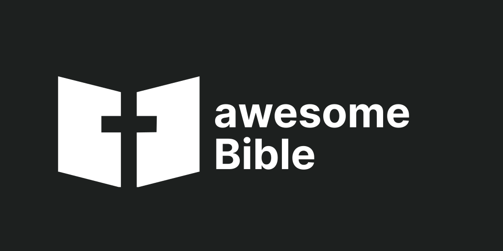
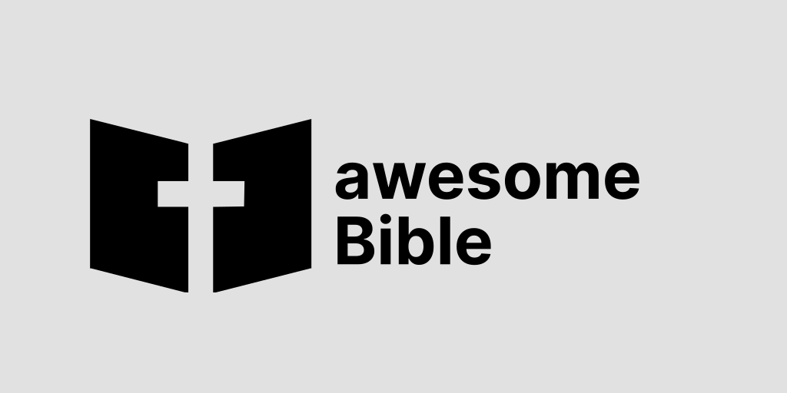
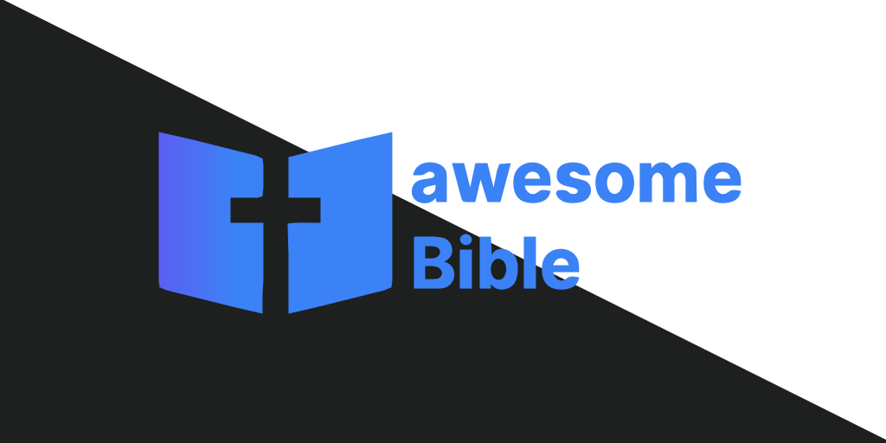

awesomeBible und die Projekte unter der "awesomeBible Umbrella" nutzen alle einheitliche Farben und Schriftarten.
Wenn du die awesomeBible-Logos oder das Branding in deinen Projekten verwenden willst, kannst du das gerne tun, wir bitten dich aber, dich dabei an ein paar Richtlinien zu halten.

## Schriftarten
Wir benutzen als unsere Schriftart auf allen awesomeBible-Websites [Inter](https://rsms.me/inter/) von Rasmus Andersson. Wenn du [eines der Logos](https://github.com/awesomeBible/assets) verwenden willst - zum Beispiel in einem Poster, Sticker oder Flyer - verwende bitte wenn möglich auch Inter als Schriftart.

## Farbpalette
Wir benutzen einheitliche Farben für awesomeBible und alle Projekte unter der awesomeBible "Umbrella".
Die Projekte haben jeweils Farbvariationen und Ergänzungen die in der UI verwendet werden.

### awesomeBible

``#0D62FF``: Das awesomeBible Blau. Auf der Website wird es für Links, Buttons, etc. benutzt.

``#1D201F``: Das schwarz wird als Hintergrundfarbe und als Sekundärfarbe benutzt.

### my.awesomeBible

``#7C3AED``: Das my.awesomeBible lila was im Logo und als Primärfarbe auf my.awesomeBible benutzt wird.

``#3B82F6``: Das my.awesomeBible blau, was im Logo und als Sekundärfarbe auf my.awesomeBible verwendet wird. 

:::note
Wenn du das awesomeBible Logo verwendest, stelle bitte sicher, dass mindestens 37 Pixel in alle Richtungen Platz ist, damit das Logo "Raum zum Atmen" hat.
:::

## Logo auf dunklem Hintergrund
Bitte benutze auf dunklen Hintergründen immer das weiße Logo.

## Logo auf hellem Hintergrund
Auf hellen Hintergründen sollte immer das schwarze Logo verwendet werden.

## Logo mit Farbverlauf
Das Logo mit Farbverlauf kann sowohl auf hellen als auch auf dunklen Hintergründen verwendet werden.

## Download
Alle awesomeBible Assets finden sich in diesem [Git Repository](https://github.com/awesomeBible/assets) und lassen sich [hier](https://github.com/awesomeBible/assets/archive/main.zip) als zip-Datei herunterladen.
