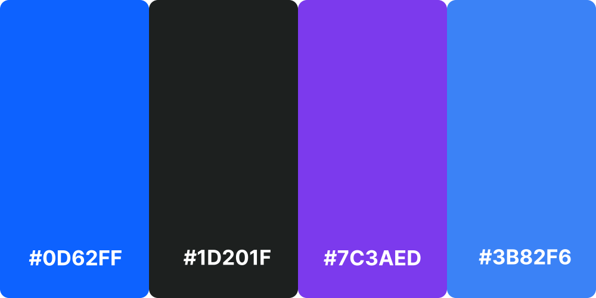
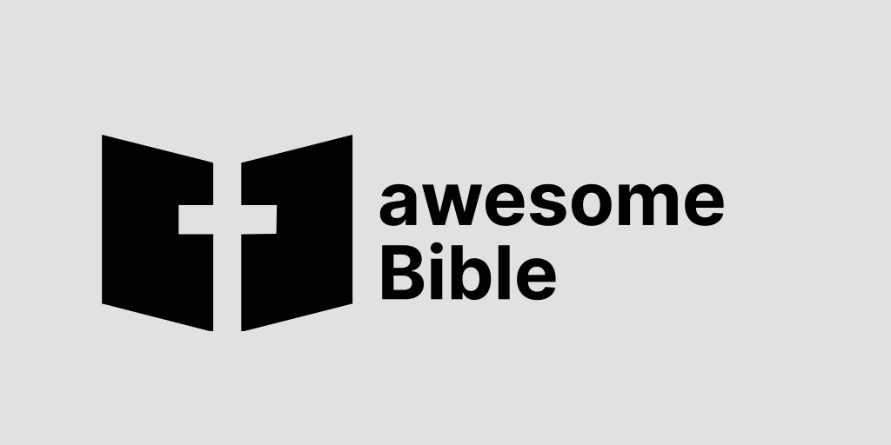

awesomeBible and the projects under the "awesomeBible Umbrella" all use consistent colors and fonts.
If you want to use the awesomeBible logos or branding in your projects, you are welcome to do so, but we ask you to follow a few guidelines.

## Fonts
We use [Inter](https://rsms.me/inter/) by Rasmus Andersson as our font on all awesomeBible websites. If you want to use [one of the logos](https://github.com/awesomeBible/assets) - for example in a poster, sticker or flyer - please also use Inter as font if possible.

## Colors
We don't really have a "fixed" color palette - colors can always be added, but those are pretty much the basics:

``#0D62FF``: The awesomeBible Blue. On the website it is used for links, buttons, etc.

``#1D201F``: The black is used as background color and as secondary color.

``#7C3AED``: The my.awesomeBible purple which is used in the logo and as primary color on my.awesomeBible.

``#3B82F6``: The my.awesomeBible blue which is used in the logo and as secondary color on my.awesomeBible.

:::note
If you are using the awesomeBible logo, please make sure there is at least 37 pixels of space in all directions so the logo has "room to breathe".
:::

## Logo on a dark background
Please always use the white logo on dark backgrounds.

## Logo on a bright background
Please always use the dark logo on bright backgrounds.

## Gradient Logo
The Gradient logo can be used on both light and dark backgrounds.

## Download
All awesomeBible Assets can be found in this [Git-Repository](https://github.com/awesomeBible/assets) and downladed [here](https://github.com/awesomeBible/assets/archive/main.zip).
