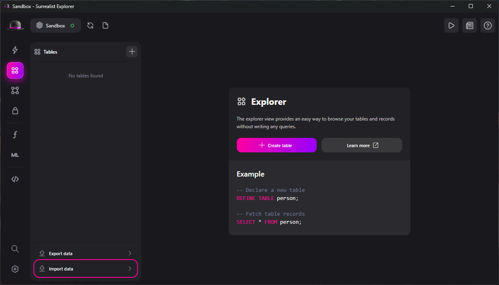
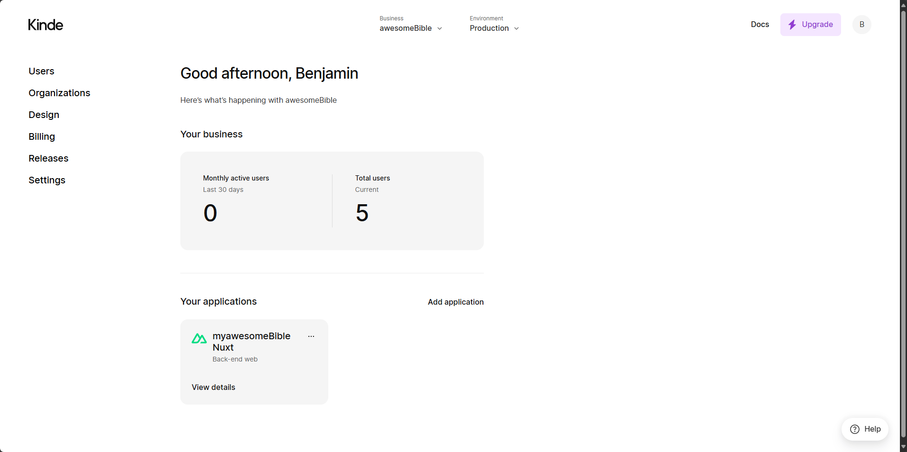
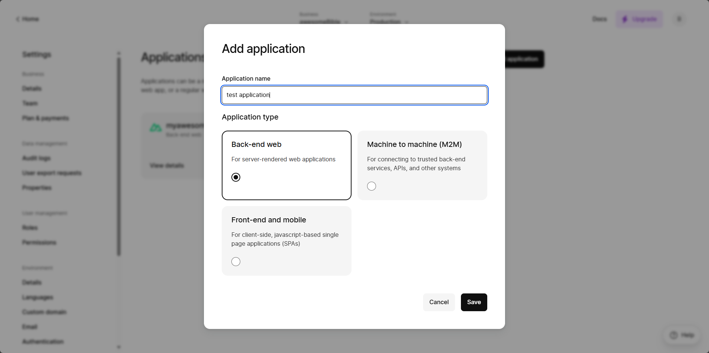
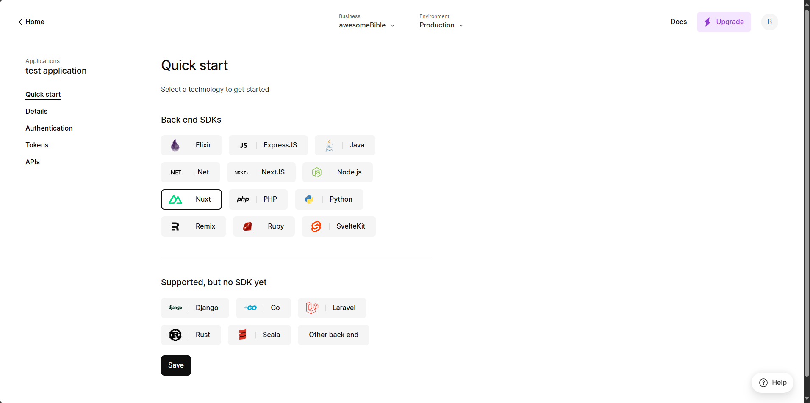
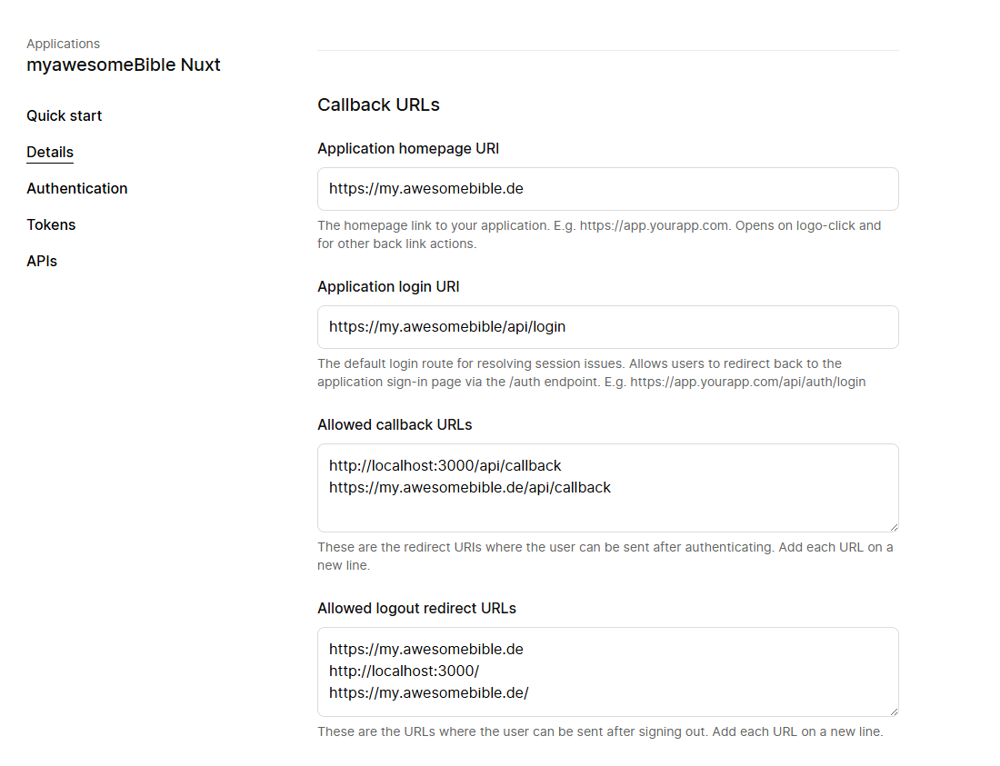
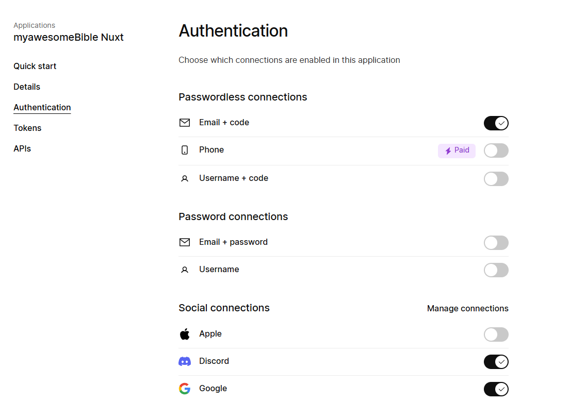

import { Tabs, TabItem } from '@astrojs/starlight/components';

:::note
 This installation guide is still a Work-in-Progress.
:::

my.awesomeBible is a [Nuxt app](https://nuxt.com) that uses [SurrealDB](https://surrealdb.com) as its database.

## Requirements
You will need:
- [NodeJS](https://nodejs.org)
- [(p)npm](https://pnpm.io/)
- [the SurrealDB CLI](https://surrealdb.com/docs/surrealdb/installation) (optionally: [Surrealist GUI](https://surrealdb.com/docs/surrealist/installation))
- [a Kinde account](https://kinde.com)

## SurrealDB Setup
To start the SurrealDB server, run the following command:

<Tabs>
  <TabItem label="Temporary Server">
  ```shell
  # ram based
  surreal start memory -A --user root --pass root
  ```
  </TabItem>
  <TabItem label="Persistent Server">
  ```shell
  # disk based server
  surreal start --log trace --user root --pass root file:mydatabase.db
  ```
  </TabItem>
</Tabs>

The database can be imported using the [SurrealQL script](https://docs.awesomebible.de/please/replace-this-v1.surql). To do that, either open Surrealist, connect to your database and click on `Import Data`. Then choose the ``surql` file.



If you use the CLI, you can import the file with the following command:

```
surreal import --conn http://localhost:8000 --user root --pass root --ns test --db test <path_to_surql_file>
```

## Kinde setup
Click on the "Add application" button on the Kinde Dashboard:



Then, choose "Back-end web" as the application type.



Under Quick start, choose Nuxt as the SDK.



Under *Details*, fill in the homepage URI, the login URI, the allowed callback URLs, and the allowed logout redirect URLs.

The homepage URI is the domain where you installed the app. 

The login URI is your domain + `/api/login`.

The Callback URL is your domain + `/api/callback`.

The logout redirect URL is the same as the homepage URI.



Under the Authentication tab, enable Email + code and if you want, the social connections for Discord and Google.
You can get the tokens for Auth in the [Google cloud console](https://console.cloud.google.com/apis/credentials) and the [Discord Developer portal](https://discord.com/developers) respectively.



## App setup
The credentials for [Kinde auth](https://kinde.com) are configured via environment variables.
Start by copying the `.env.example` file to `.env` and fill in the credentials.

```
NUXT_KINDE_AUTH_DOMAIN=
NUXT_KINDE_CLIENT_ID=
NUXT_KINDE_CLIENT_SECRET=
NUXT_KINDE_REDIRECT_URL=
NUXT_KINDE_LOGOUT_REDIRECT_URL=
NUXT_KINDE_POST_LOGIN_REDIRECT_URL=
```

Now we can run `(p)npm install` in the folder we cloned my.awesomeBible into and then run `npm run dev` to start the dev server.

| Command                   | Action                                           |
| :------------------------ | :----------------------------------------------- |
| `npm install`             | Installs dependencies                            |
| `npm run dev`             | Starts local dev server at `localhost:3000`      |
| `npm run build`           | Build your production site to `./output/`        |
| `npm run preview`         | Preview your build locally, before deploying     |
