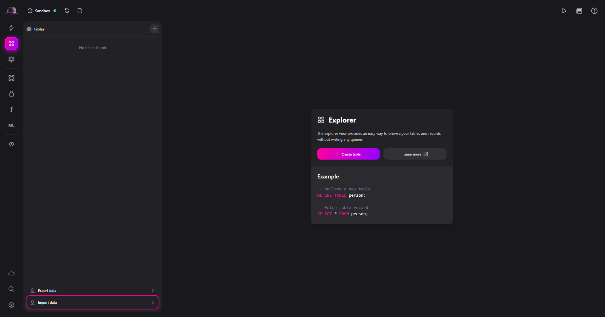
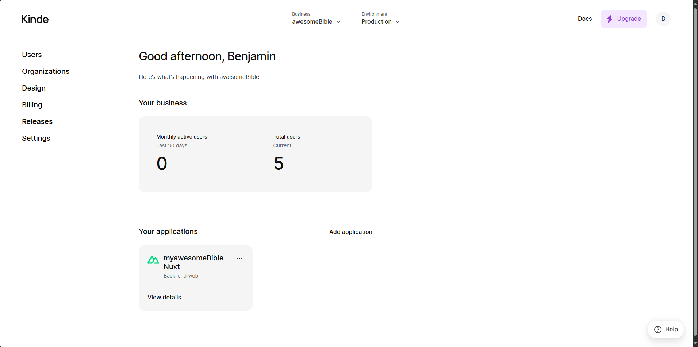
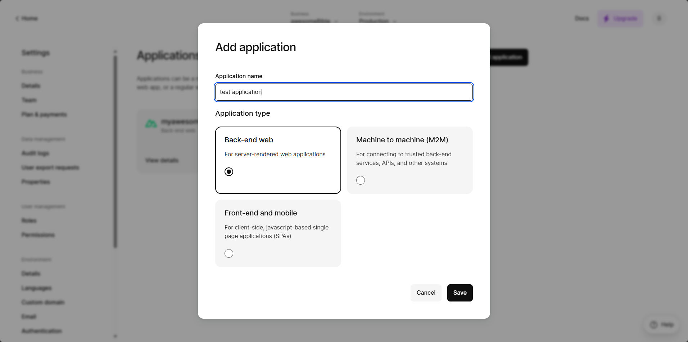
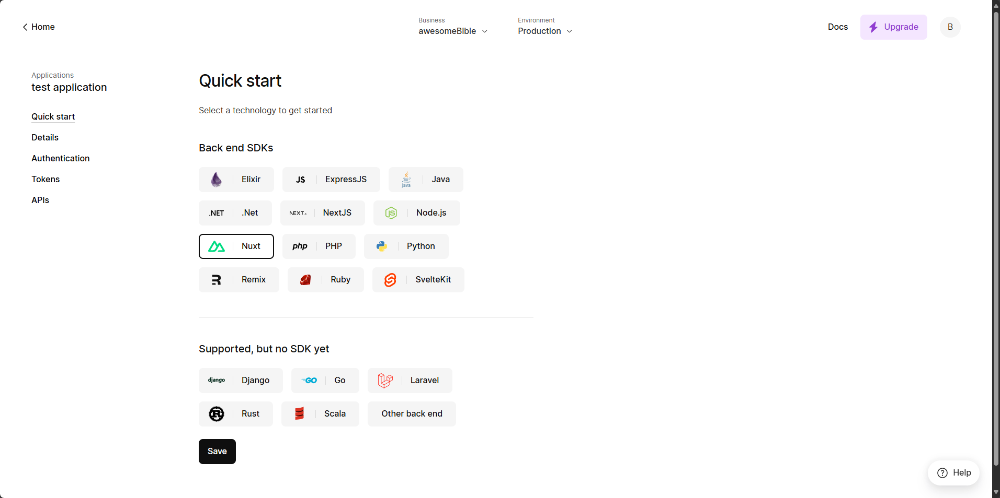
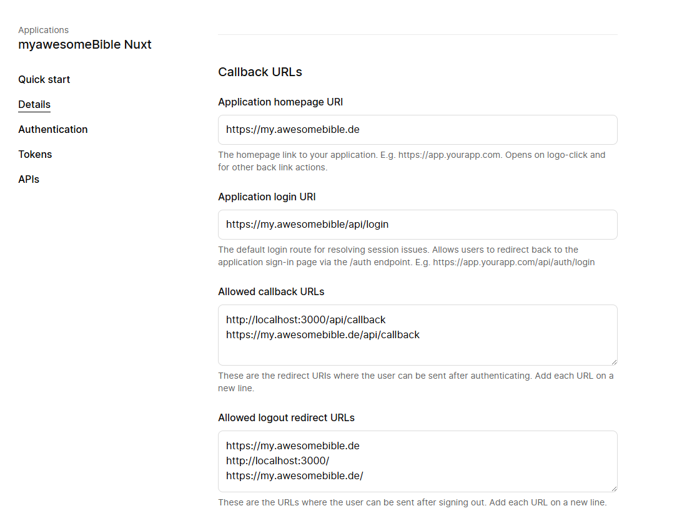
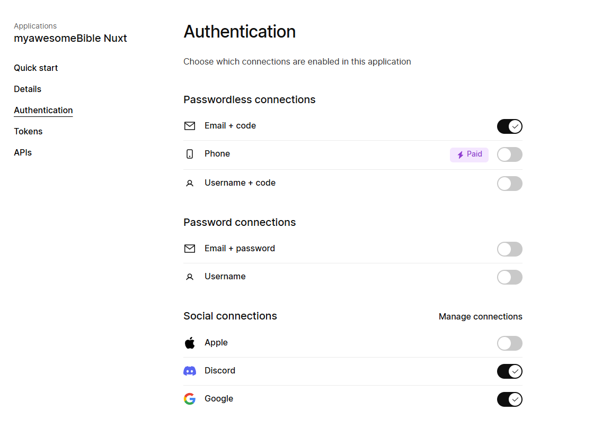

import { Tabs, TabItem } from '@astrojs/starlight/components';

:::note
 Die Installationsanleitung ist noch ein Work-In-Progress.
:::

my.awesomeBible ist eine [Nuxt-App](https://nuxt.com) die als Datenbank [SurrealDB](https://surrealdb.com) nutzt.

## Voraussetzungen
Du brauchst:
- [NodeJS](https://nodejs.org)
- [(p)npm](https://pnpm.io/)
- [die SurrealDB CLI](https://surrealdb.com/docs/surrealdb/installation) (optional: [Surrealist GUI](https://surrealdb.com/docs/surrealist/installation))
- [einen Kinde account](https://kinde.com)

Um das Git-Repo zu klonen führe folgenden Befehl aus:

```sh
git clone https://github.com/awesomebible/my.awesomeBible-nuxt.git
```

## SurrealDB Setup
Um den SurrealDB Server zu starten führe folgenden Befehl aus:

<Tabs>
  <TabItem label="Temporärer Server">
    ```shell
    # ram based
    surreal start memory -A --user root --pass root
    ```
  </TabItem>
  <TabItem label="Persistenter Server">
    ```shell
    # disk based server
    surreal start --log trace --user root --pass root file:mydatabase.db
    ```
  </TabItem>
</Tabs>

Die Datenbank kann mithilfe des [SurrealQL Skriptes](/files/myawesomebible/2024-08-20.surql) eingerichtet werden. Öffne dazu Surrealist, stelle eine Verbindung zum Datenbankserver her und klicke dann auf `Import Data`. Dann kannst du mit dem Dateimanager die ``surql`` Datei auswählen.



Wenn du die CLI benutzt, kannst du die Datei mit folgendem Befehl importieren:

```sh
surreal import --conn http://localhost:8000 --user root --pass root --ns test --db test <pfad_zur_surql_datei>
```

## Kinde setup
Klicke auf den Button "Add Application" auf dem Kinde Dashboard:



Wähle dann "Back-end web" als Application type aus.



Unter Quick start, wähle Nuxt als SDK aus.



Fülle unter *Details* die Startseiten URI, die Login URI, die Callback URLs und die Logout Weiterleitungs URLs ein.

Die Homepage URI ist die Domain, auf der du die App installiert hast.

Die Login URI ist deine Domain + `/api/login`.

Die Callback URL ist deine Domain + `/api/callback`.

Die Logout Weiterleitungs URL ist die selbe URL wie die homepage URI.



Unter dem Authentication-Tab, aktiviere Email + code und wenn gewünscht die Social connections für Discord und Google.
Die Tokens für Google und Discord auth kannst du jeweils in der [Google Cloud Console](https://console.cloud.google.com/apis/credentials) und dem [Discord Entwicklerportal](https://discord.com/developers) erstellen.



## App setup

Die Zugangsdaten für [Kinde auth](https://kinde.com) werden über Umgebungsvariablen konfiguriert.
Erstelle dazu eine `.env`-Datei im Projectroot und füge die Umgebungsvariablen aus dem Kinde Dashboard ein.


Jetzt können wir im Ordner in den wir my.awesomeBible geklont haben, `npm install` ausführen und anschließend mit `npm run dev` den Dev-Server starten.

| Command                   | Action                                           |
| :------------------------ | :----------------------------------------------- |
| `npm install`             | Installs dependencies                            |
| `npm run dev`             | Starts local dev server at `localhost:3000`      |
| `npm run build`           | Build your production site to `./output/`        |
| `npm run preview`         | Preview your build locally, before deploying     |